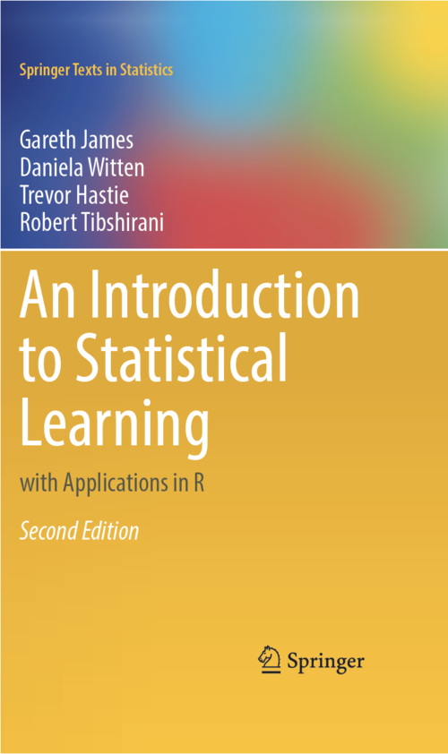

# ISLR-2ndEd-python

This repository contains python code for the lab exercises from the second edition of the book <A target="_blank" href='https://www.statlearning.com/'>'An Introduction to Statistical Learning with Applications in R'</A> by James, Witten, Hastie, Tibshirani (2013).

 

<A href='https://github.com/ehmtang/ISLR-2ndEd-python/blob/master/Notebooks/ch03-Linear-Regression.ipynb'>Chapter 3 - Linear Regression</A> 
<A href='https://github.com/ehmtang/ISLR-2ndEd-python/blob/master/Notebooks/ch04-Classification.ipynb'>Chapter 4 - Classification</A> 
<A href='https://github.com/ehmtang/ISLR-2ndEd-python/blob/master/Notebooks/ch05-Resampling-Methods.ipynb'>Chapter 5 - Resampling Methods</A> 
<A href='https://github.com/ehmtang/ISLR-2ndEd-python/blob/master/Notebooks/ch06-Linear-Model-Selection-and-Regularisation.ipynb'>Chapter 6 - Linear Model Selection and Regularization</A> 
<A href='https://github.com/ehmtang/ISLR-2ndEd-python/blob/master/Notebooks/ch07-Moving-Beyond-Linearity.ipynb'>Chapter 7 - Moving Beyond Linearity</A> 
<A href='https://github.com/ehmtang/ISLR-2ndEd-python/blob/master/Notebooks/ch08-Tree-Based-Methods.ipynb'>Chapter 8 - Tree-Based Methods</A> 
<A href='https://github.com/ehmtang/ISLR-2ndEd-python/blob/master/Notebooks/ch09-Support-Vector-Machines.ipynb'>Chapter 9 - Support Vector Machines</A> 
<A href='https://github.com/ehmtang/ISLR-2ndEd-python/blob/master/Notebooks/ch10-Deep-Learning.ipynb'>Chapter 10 - Deep Learning</A> 
<A href='https://github.com/ehmtang/ISLR-2ndEd-python/blob/master/Notebooks/ch11-Survival-Analysis-and-Censored-Data.ipynb'>Chapter 11 - Survival Analysis and Censored Data</A> 
<A href='https://github.com/ehmtang/ISLR-2ndEd-python/blob/master/Notebooks/ch12-Unsupervised-Learning.ipynb'>Chapter 12 - Unsupervised Learning</A> 
<A href='https://github.com/ehmtang/ISLR-2ndEd-python/blob/master/Notebooks/ch13-Multiple-Testing.ipynb'>Chapter 13 - Multiple Testing</A>

 
### References:
James, G., Witten, D., Hastie, T., Tibshirani, R. (2021). <I>An Introduction to Statistical Learning with Applications in  R, Second Edition</I>,  Springer Science+Business Media, New York.
https://www.statlearning.com/

James, G., Witten, D., Hastie, T., Tibshirani, R. (2013). <I>An Introduction to Statistical Learning with Applications in  R</I>,  Springer Science+Business Media, New York.
https://www.statlearning.com/

Hastie, T., Tibshirani, R., Friedman, J. (2009). <I>Elements of Statistical Learning</I>, Second Edition, Springer Science+Business Media, New York.
http://statweb.stanford.edu/~tibs/ElemStatLearn/

Special thank to @JWarmenhoven check his repo out https://github.com/JWarmenhoven/ISLR-python
